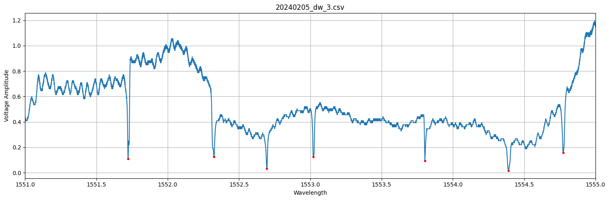
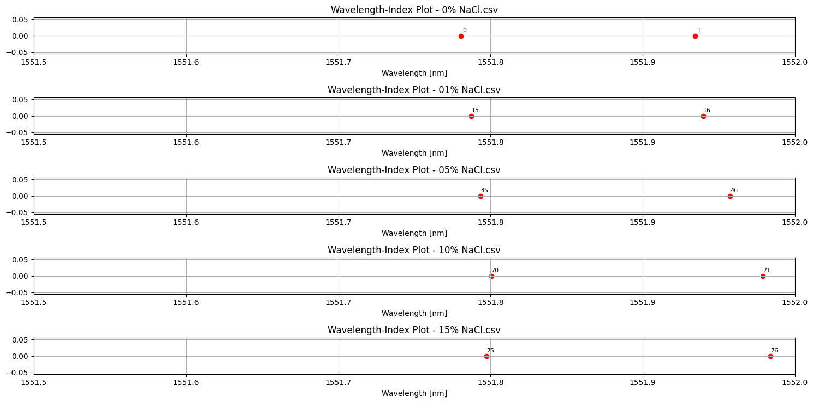
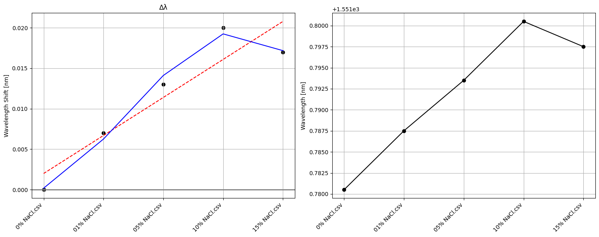

# Wavelength-Amplitude data visualization, and Wavelength Shift Calculation Code written by Necati Buhur

## Code Requirements

```python
#All Python code v 3.0 Google Compute Engine - Google Colab
#Dependencies:
import os
import csv
import pandas as pd
import numpy as np
import matplotlib.pyplot as plt
from scipy.signal import find_peaks
from sklearn.preprocessing import RobustScaler
from sklearn.linear_model import LinearRegression

#Installation of dependencies:
pip install pandas numpy matplotlib scipy scikit-learn
```

## Usage
After the depencies are installed:

### Running the code in Google Colab

1. Open Google Colab ([colab.research.google.com](https://colab.research.google.com/)).
2. Go to "File" > "Open notebook" > "GitHub".
3. Paste the URL of your GitHub repository (e.g., `https://github.com/nicobuhur/ring-resonator-wave-shift`).
4. Select the notebook file (e.g., `waveform_resonator_colab.ipynb`) you want to run.
5. Follow the instructions in the notebook to execute the code cells.

### Running the Code Locally

To run the code locally on your machine, follow these steps:

1. Navigate to the file named `waveform_resonator_colab.ipynb` in the repository `ring-resonator-wave-shift`.
2. Download the notebook in raw format by clicking on the "Raw" button.
3. Open the notebook using a Python software environment such as Jupyter Notebook or JupyterLab.
4. Follow the instructions provided within the notebook to execute the code cells and interact with the code.

By following these steps, you will be able to run the code locally and explore its functionalities in your own Python environment.

## Compatibility
Functions are designed for data acquired from Micro Ring Resonator experiments, and software "PicoScope 7 T&M" is used to read electric signals. Software crates waveforms which are written into csv files. In data, voltage over time is exhibited, and time parameters is turned into wavelength with programming. Example data is provided in repository. 

## Manuscript Information
Some highlights about output images are below

Voltage amplitudes between wavelengths of 1551 and 1555 nm. There are voltage drops, which are resonance peaks. Different parameters such as temperature or surface applications can affect those resonance peaks, which lead to the detection of changing parameter. As the shifting of resonance peaks increases, effect of paramater increases. 

To analyze the peaks, each peak is matched with its index so that they can be compared easily. Function asks reference index and further indexes to compare. Indexes can be obversed as below.


As reference peak, index 6 is selected. Indexes to be compared are 36,61,65,95, respectively. Once peaks are selected, their comparison can be obversed using ploting function.


## Acknowledges
The author would like to extend sincere appreciation to the JointLab Bioelectronics at Technische Universität Berlin, under the leadership of Prof. Mario Birkholz, for providing the necessary resources and conducive environment for conducting the experiments and research presented in this project. Special thanks are due to Phillip Schrenk, a bachelor student at JointLab Bioelectronics, for generously sharing NaCl data and providing valuable insights into the theory and application of micro ring resonators. Furthermore, the author acknowledges Anders Henriksson for his significant contributions to data processing and wavelength calculation, which have greatly enriched the quality and depth of this work.
